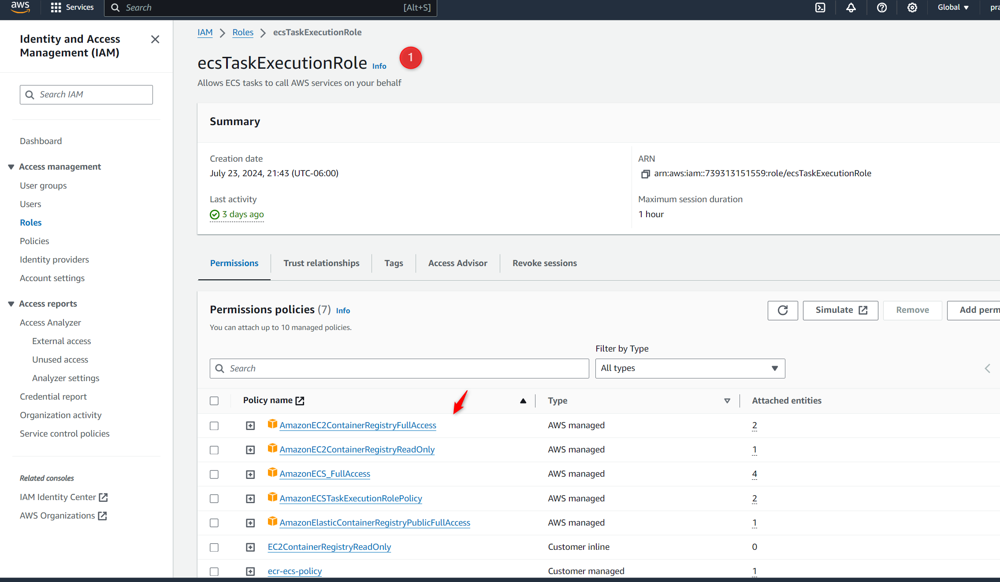

Deploying a simple HTML web app to AWS ECS using Jenkins involves several steps to ensure smooth integration and deployment. Here’s a detailed guide to achieve this:

Prerequisites
AWS Account: Ensure you have an active AWS account.
Docker: Install Docker on your local machine.
AWS CLI: Install and configure the AWS CLI.
Jenkins: Install Jenkins on your local machine or use a Jenkins server.
Git Repository: Set up a Git repository (e.g., GitHub, GitLab).
AWS IAM Role: Create an IAM role with permissions for ECS, ECR, and other related services.

Steps:
1. Prepare the HTML Web App
Create a simple HTML web app. For example:

2. Dockerize the Application
Create a Dockerfile to containerize your web app.

3. Create a Docker Repository on AWS ECR
Create ECR Repository:

aws ecr create-repository --repository-name simple-html-web-app

Login to ECR:
aws ecr get-login-password --region <your-region> | docker login --username AWS --password-stdin <your-aws-account-id>.dkr.ecr.<your-region>.amazonaws.com

4. Push the Docker Image to ECR
Build Docker Image:

docker build -t simple-html-web-app .

Tag Docker Image:
docker tag simple-html-web-app:latest <your-aws-account-id>.dkr.ecr.<your-region>.amazonaws.com/simple-html-web-app:latest

Push Docker Image:
docker push <your-aws-account-id>.dkr.ecr.<your-region>.amazonaws.com/simple-html-web-app:latest

5. Create ECS Cluster and Task Definition
Create ECS Cluster:

aws ecs create-cluster --cluster-name simple-html-web-app-cluster

Create Task Definition:

{
    "family": "ecs-task-def",
    "taskRoleArn": "arn:aws:iam::739313151559:role/ecsTaskExecutionRole",
    "executionRoleArn": "arn:aws:iam::739313151559:role/ecsTaskExecutionRole",
    "networkMode": "awsvpc",
    "containerDefinitions": [
        {
            "name": "ecs-container1",
            "image": "REPLACE_WITH_IMAGE_TAG",
            "cpu": 256,
            "memory": 512,
            "essential": true,
            "portMappings": [
                {
                    "containerPort": 80,
                    "hostPort": 80
                }
            ],
            "logConfiguration": {
                "logDriver": "awslogs",
                "options": {
                    "awslogs-group": "/ecs/web-app",
                    "awslogs-region": "us-east-1",
                    "awslogs-stream-prefix": "ecs"
                }
            }
        }
    ],
    "requiresCompatibilities": [
        "FARGATE"
    ],
    "cpu": "256",
    "memory": "512"
}

Register Task Definition:
aws ecs register-task-definition --cli-input-json file://task-definition.json

6. Create ECS Service
Create Service:

aws ecs create-service \
  --cluster simple-html-web-app-cluster \
  --service-name simple-html-web-app-service \
  --task-definition simple-html-web-app-task \
  --desired-count 1 \
  --launch-type FARGATE \
  --network-configuration "awsvpcConfiguration={subnets=[<your-subnet-id>],securityGroups=[<your-security-group-id>],assignPublicIp=ENABLED}"

