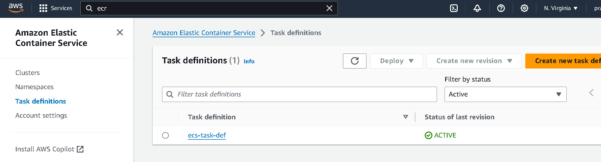

https://repost.aws/questions/QU9F_AytI2TdiWImN1YVed8Q/deploy-an-ecs-fargate-task-with-a-new-image

Here’s a detailed Markdown (`.md`) document for deploying a Docker application to AWS ECS and ECR using Jenkins. This document covers all the necessary steps, from setting up your AWS environment to configuring Jenkins and deploying your application.

---

# AWS ECS and ECR Deployment Documentation

## Overview

This document provides a comprehensive guide for deploying a Docker application to AWS ECS (Elastic Container Service) and ECR (Elastic Container Registry) using Jenkins. The deployment process involves building a Docker image, pushing it to ECR, updating the ECS task definition, and deploying the updated task definition to an ECS service.

## Prerequisites
AWS Account: Ensure you have an active AWS account.
Docker: Install Docker on your local machine.
AWS CLI: Install and configure the AWS CLI.
Jenkins: Install Jenkins on your local machine or use a Jenkins server.
Git Repository: Set up a Git repository (e.g., GitHub, GitLab).
AWS IAM Role: Create an IAM role with permissions for ECS, ECR, and other related services.

## AWS Setup

### 1. Create an ECR Repository

1. Navigate to the [Amazon ECR console](https://console.aws.amazon.com/ecr).
2. Click **Create repository**.
3. Enter a repository name (e.g., `simple-html-web-app`).
4. Click **Create repository**.


### 2. Create an ECS Cluster

1. Navigate to the [Amazon ECS console](https://console.aws.amazon.com/ecs).
2. Click **Create cluster**.
3. Select **Networking only** for Fargate.
4. Enter a cluster name (e.g., `simple-html-web-app-cluster`).
5. Click **Create**.

### 3. Create an ECS Task Execution Role

1. Navigate to the [IAM console](https://console.aws.amazon.com/iam).
2. Click **Roles** and then **Create role**.
3. Select **ECS** as the service that will use this role.
4. Select **ECS Task Execution Role** policy.
5. Click **Next: Tags**, then **Next: Review**.
6. Enter a role name (e.g., `ecsTaskExecutionRole`) and click **Create role**.

### 4. Create an ECS Service Role

1. Repeat the steps above to create a role with the necessary policies to allow ECS to interact with other AWS services (e.g., CloudWatch, ELB).

## Jenkins Configuration

### 1. Install Necessary Plugins

1. **AWS Steps**: For AWS-related operations.
2. **Pipeline**: For creating Jenkins pipelines.
3. **Git**: For cloning repositories.

### 2. Configure AWS Credentials in Jenkins

1. Navigate to **Manage Jenkins** > **Manage Credentials**.
2. Select the appropriate domain or **(global)**.
3. Click **Add Credentials**.
4. Select **Amazon Web Services Credentials**.
5. Enter your AWS Access Key ID and Secret Access Key.
6. Enter an ID for the credentials (e.g., `aws-credentials-id`).

### 3. Create Jenkins Pipeline Job

1. Navigate to **New Item**.
2. Select **Pipeline** and enter a name (e.g., `ecs-deployment-pipeline`).
3. Under **Pipeline**, select **Pipeline script** and paste the Jenkinsfile provided below.

## Jenkinsfile

```groovy
pipeline {
    agent any

    parameters {
        string(name: 'IMAGE_TAG', defaultValue: 'latest', description: 'Docker image tag')
    }

    environment {
        AWS_ACCOUNT_ID = '739313151559'
        AWS_REGION = 'us-east-1'
        ECR_REPO = 'simple-html-web-app'
        ECR_REPO_URI = '739313151559.dkr.ecr.us-east-1.amazonaws.com/simple-html-web-app'
        REGISTRY_CREDENTIAL = 'aws-credentials-id' // Ensure this matches the credentials ID in Jenkins
        IMAGE_TAG = "latest-${env.BUILD_NUMBER}" // Unique tag for each build
        ECS_CLUSTER = 'simple-html-web-app-cluster'
        ECS_SERVICE = 'ecs-demo-srv'
        TASK_DEFINITION_FAMILY = 'ecs-task-def'
    }

    stages {
        stage('Test Credentials') {
            steps {
                script {
                    withCredentials([[$class: 'AmazonWebServicesCredentialsBinding', credentialsId: "${REGISTRY_CREDENTIAL}"]]) {
                        sh 'aws sts get-caller-identity'
                    }
                }
            }
        }

        stage('Clone Git Repository') {
            steps {
                checkout([$class: 'GitSCM',
                    branches: [[name: '*/master']],
                    doGenerateSubmoduleConfigurations: false,
                    extensions: [],
                    submoduleCfg: [],
                    userRemoteConfigs: [[credentialsId: '', url: 'https://github.com/prafulpatel16/ecs-demo.git']]
                ])
            }
        }

        stage('Build and Push Docker Image') {
            steps {
                script {
                    // Build and tag Docker image with specified tag
                    sh "docker build -t ${ECR_REPO_URI}:${params.IMAGE_TAG} ."
                    
                    // Login to AWS ECR
                    withCredentials([[$class: 'AmazonWebServicesCredentialsBinding', credentialsId: "${REGISTRY_CREDENTIAL}"]]) {
                        sh """
                        aws ecr get-login-password --region ${AWS_REGION} | docker login --username AWS --password-stdin ${ECR_REPO_URI}
                        """
                    }
                    
                    // Push Docker image to ECR
                    sh "docker push ${ECR_REPO_URI}:${params.IMAGE_TAG}"
                }
            }
        }

        stage('Update ECS Task Definition') {
            steps {
                script {
                    // Load and update task definition JSON
                    def taskDefinition = readFile 'taskdef.json'
                    taskDefinition = taskDefinition.replace("REPLACE_WITH_IMAGE_TAG", "${ECR_REPO_URI}:${params.IMAGE_TAG}")
                    
                    // Write updated task definition to file
                    writeFile file: 'taskdef.json', text: taskDefinition
                    
                    // Register updated task definition
                    withCredentials([[$class: 'AmazonWebServicesCredentialsBinding', credentialsId: "${REGISTRY_CREDENTIAL}"]]) {
                        sh "aws ecs register-task-definition --cli-input-json file://taskdef.json"
                    }
                }
            }
        }

        stage('Deploy ECS Service') {
            steps {
                script {
                    // Update ECS service with new task definition revision
                    withCredentials([[$class: 'AmazonWebServicesCredentialsBinding', credentialsId: "${REGISTRY_CREDENTIAL}"]]) {
                        sh "aws ecs update-service --cluster ${ECS_CLUSTER} --service ${ECS_SERVICE} --task-definition ${TASK_DEFINITION_FAMILY}"
                    }
                }
            }
        }
    }
}
```

## `taskdef.json`

Ensure your `taskdef.json` file is correctly configured and placed in the Jenkins workspace. Here’s the file:

```json
{
    "family": "ecs-task-def",
    "taskRoleArn": "arn:aws:iam::739313151559:role/ecsTaskExecutionRole",
    "executionRoleArn": "arn:aws:iam::739313151559:role/ecsTaskExecutionRole",
    "networkMode": "awsvpc",
    "containerDefinitions": [
      {
        "name": "ecs-container1",
        "image": "REPLACE_WITH_IMAGE_TAG",
        "cpu": 256,
        "memory": 512,
        "essential": true,
        "portMappings": [
          {
            "containerPort": 80,
            "hostPort": 80
          }
        ]
      }
    ],
    "requiresCompatibilities": [
      "FARGATE"
    ],
    "cpu": "256",
    "memory": "512"
}
```

## Deployment Steps

1. **Configure AWS Credentials**: Ensure Jenkins has the necessary AWS credentials configured.
2. **Create Jenkins Pipeline Job**: Use the provided Jenkinsfile to define your pipeline.
3. **Commit `taskdef.json`**: Ensure `taskdef.json` is included in your repository.
4. **Run Jenkins Pipeline**: Trigger the pipeline in Jenkins to start the deployment process.
5. **Monitor Deployment**: Check the logs and AWS ECS console to verify the deployment.

## Troubleshooting

- **Credentials Issues**: Verify AWS credentials in Jenkins and IAM roles.
- **Docker Issues**: Ensure Docker is properly configured and running on the Jenkins server.
- **Task Definition Errors**: Validate `taskdef.json` and ensure all required parameters are provided.

---

This document should provide a complete guide for setting up and deploying your application using AWS ECS, ECR, and Jenkins. If you encounter any issues or have additional questions, feel free to ask!

Infrastrucutre setup

Setting up the relevant VPCs and related infrastructure for deploying an application on AWS ECS involves several steps. Here's a detailed guide to help you through the process:

### Step 1: Create a VPC

1. **Login to AWS Management Console**
   - Go to the [VPC Dashboard](https://console.aws.amazon.com/vpc/).

2. **Create a VPC**
   - Click on **Create VPC**.
   - Choose **VPC only**.
   - Configure the VPC details:
     - Name tag: `my-vpc`
     - IPv4 CIDR block: `10.0.0.0/16`
     - IPv6 CIDR block: No IPv6 CIDR Block
     - Tenancy: Default
   - Click on **Create VPC**.

### Step 2: Create Subnets

1. **Create Public Subnet**
   - Go to the [Subnets section](https://console.aws.amazon.com/vpc/home?#subnets:).
   - Click on **Create subnet**.
   - Select your VPC (`my-vpc`).
   - Configure the subnet details:
     - Subnet name: `my-public-subnet`
     - Availability Zone: Choose an availability zone (e.g., `us-east-1a`)
     - IPv4 CIDR block: `10.0.1.0/24`
   - Click on **Create subnet**.

2. **Create Private Subnet**
   - Click on **Create subnet**.
   - Select your VPC (`my-vpc`).
   - Configure the subnet details:
     - Subnet name: `my-private-subnet`
     - Availability Zone: Choose an availability zone (e.g., `us-east-1a`)
     - IPv4 CIDR block: `10.0.2.0/24`
   - Click on **Create subnet**.

### Step 3: Create an Internet Gateway

1. **Create Internet Gateway**
   - Go to the [Internet Gateways section](https://console.aws.amazon.com/vpc/home?#igws:).
   - Click on **Create internet gateway**.
   - Name tag: `my-igw`
   - Click on **Create internet gateway**.

2. **Attach Internet Gateway to VPC**
   - Select the newly created Internet Gateway (`my-igw`).
   - Click on **Actions** and select **Attach to VPC**.
   - Choose your VPC (`my-vpc`) and click on **Attach internet gateway**.

### Step 4: Create Route Tables

1. **Create Route Table for Public Subnet**
   - Go to the [Route Tables section](https://console.aws.amazon.com/vpc/home?#routetables:).
   - Click on **Create route table**.
   - Configure the route table details:
     - Name tag: `my-public-route-table`
     - VPC: Select your VPC (`my-vpc`)
   - Click on **Create route table**.

2. **Add Route to Public Route Table**
   - Select the newly created route table (`my-public-route-table`).
   - Click on the **Routes** tab.
   - Click on **Edit routes**.
   - Click on **Add route**.
     - Destination: `0.0.0.0/0`
     - Target: Select `Internet Gateway` and choose your IGW (`my-igw`)
   - Click on **Save routes**.

3. **Associate Route Table with Public Subnet**
   - Select the `my-public-route-table`.
   - Click on the **Subnet associations** tab.
   - Click on **Edit subnet associations**.
   - Select your public subnet (`my-public-subnet`).
   - Click on **Save associations**.

### Step 5: Create Security Groups

1. **Create Security Group for ECS Tasks**
   - Go to the [Security Groups section](https://console.aws.amazon.com/vpc/home?#securityGroups:).
   - Click on **Create security group**.
   - Configure the security group details:
     - Security group name: `ecs-tasks-sg`
     - Description: Security group for ECS tasks
     - VPC: Select your VPC (`my-vpc`)
   - Click on **Create security group**.

2. **Add Inbound Rules to Security Group**
   - Select the `ecs-tasks-sg` security group.
   - Click on the **Inbound rules** tab.
   - Click on **Edit inbound rules**.
   - Click on **Add rule**.
     - Type: HTTP
     - Protocol: TCP
     - Port range: 80
     - Source: Anywhere (0.0.0.0/0)
   - Click on **Save rules**.

### Step 6: Create an ECS Cluster

1. **Create ECS Cluster**
   - Go to the [ECS Dashboard](https://console.aws.amazon.com/ecs/home).
   - Click on **Clusters** in the left-hand menu.
   - Click on **Create Cluster**.
   - Select **Networking only** and click on **Next step**.
   - Configure the cluster details:
     - Cluster name: `my-ecs-cluster`
   - Click on **Create**.

### Step 7: Create an ECS Task Definition

1. **Create Task Definition**
   - Go to the [Task Definitions section](https://console.aws.amazon.com/ecs/home?#/taskDefinitions).
   - Click on **Create new Task Definition**.
   - Select **FARGATE** and click on **Next step**.
   - Configure the task definition details:
     - Task Definition Name: `simple-html-web-app-task`
     - Task Role: None
     - Network Mode: awsvpc
     - Requires compatibilities: FARGATE
     - CPU: `256`
     - Memory: `512`
   - Add container details:
     - Click on **Add container**.
     - Container name: `simple-html-web-app`
     - Image: `<your-ecr-repo-url>/simple-html-web-app:latest`
     - Port mappings: Container port `80`, Protocol `TCP`
   - Click on **Add**.
   - Click on **Create**.

### Step 8: Create an ECS Service

1. **Create Service**
   - Go to the [ECS Dashboard](https://console.aws.amazon.com/ecs/home).
   - Click on **Clusters** in the left-hand menu.
   - Select your cluster (`my-ecs-cluster`).
   - Click on **Create** under the Services tab.
   - Configure the service details:
     - Launch type: FARGATE
     - Task Definition: Select your task definition (`simple-html-web-app-task`)
     - Platform version: Latest
     - Cluster: `my-ecs-cluster`
     - Service name: `simple-html-web-app-service`
     - Number of tasks: `1`
   - Configure the network:
     - Cluster VPC: Select your VPC (`my-vpc`)
     - Subnets: Select your public subnet (`my-public-subnet`)
     - Security groups: Select your security group (`ecs-tasks-sg`)
     - Auto-assign public IP: ENABLED
   - Click on **Next step**.
   - Click on **Next step**.
   - Click on **Create Service**.

### Step 9: Verify the Deployment

1. **Check Service Status**
   - Go to the [ECS Dashboard](https://console.aws.amazon.com/ecs/home).
   - Select your cluster (`my-ecs-cluster`).
   - Check the status of your service (`simple-html-web-app-service`).

2. **Access the Application**
   - Go to the EC2 Dashboard and select your running task.
   - Get the public IP address assigned to your task.
   - Open a web browser and navigate to `http://<public-ip>`.

By following these detailed steps, you will have created a VPC, subnets, security groups, and deployed a simple HTML web app to AWS ECS. If you encounter any issues or need further assistance, feel free to ask!

# Define the Policy JSON

EC2ContainerRegistryReadOnly
{
    "Version": "2012-10-17",
    "Statement": [
        {
            "Effect": "Allow",
            "Action": [
                "ecr:BatchCheckLayerAvailability",
                "ecr:BatchGetImage",
                "ecr:DescribeRepositories",
                "ecr:GetDownloadUrlForLayer",
                "ecr:ListImages",
                "ecr:DescribeImages",
                "ecr:GetRepositoryPolicy",
                "ecr:DescribeImageScanFindings",
                "ecr:ListTagsForResource",
                "ecr:DescribeRegistry",
                "ecr:GetAuthorizationToken"
            ],
            "Resource": "*"
        }
    ]
}


